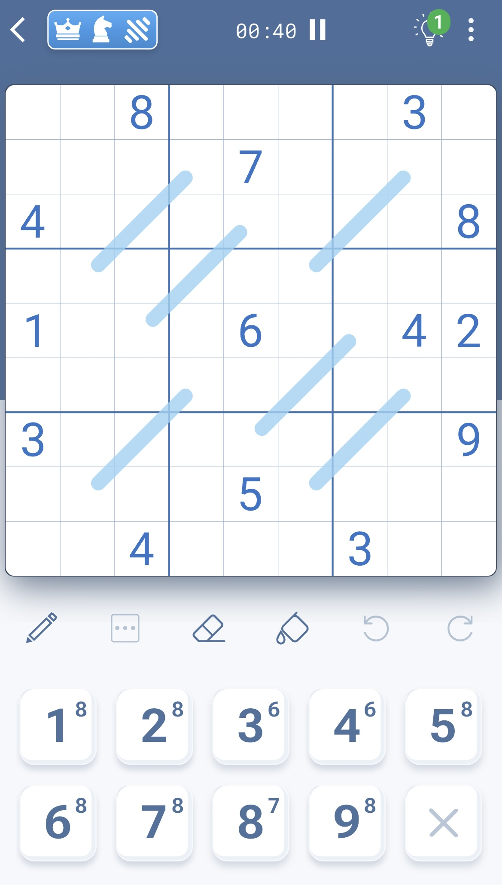

# LP-Sudoku-Variants

This repository is dedicated to a linear programming solution of multiple sudoku variants using Pythons PULP library.

The variants are defined as by the app Sudoku Variants by Logic Wiz, and I have no affiliation to Logic Wiz!

## Sudoku
This section contains a brief introduction and python code to solve a basic sudoku with linear programming.

## Killer Sudoku
This section contains a detailed linear programming model and python code to solve a killer sudoku with linear programming.

In killer sudoku, the board contains multiple sections. Each section is made of 2 or more adjacent cells where all values in those cells have to add, subtract, multiply or divide to a given result.

In case of subtraction or division, a section will always contain exactly 2 cells.

## Sudoku Variants
Sudoku with one or more special variants adding more rules and complexity to the game.

Variants currently implemented in my linear programming model:

Diagonal

Non consecutive neighbors

Chess king

Chess knight

Thermometer

Palindrome

Kropki

XV

Killer

More variants will arrive later...

The code is preset to solve the following sudoku with chess king, chess knight and palindrome where the blue lines shows the cells in the palindromes.

